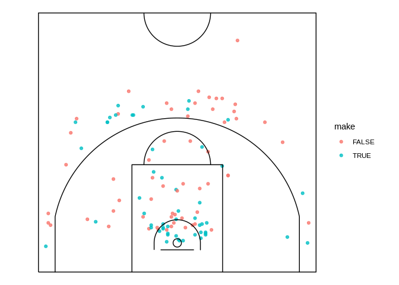

<!-- README.md is generated from README.Rmd. Please edit that file -->
eurolig
=======

[](https://www.tidyverse.org/lifecycle/#experimental)

The eurolig package provides a set of tools to obtain and analyze basketball data from the Euroleague.

Overview
--------

-   API wrapper around the official website of the [Euroleague](https://www.euroleague.net/).

-   Functions to obtain stats, play-by-play data and shot location data in a tidy format within R.

-   Tools to analyze and visualize the data.

Installation
------------

``` r
# install.packages("devtools")
devtools::install_github("solmos/eurolig")
```

Example
-------

Let's say we want to analyze play-by-play data from the Championship game of the 2017-2018 season between Real Madrid and Fenerbache Dogus Istanbul. We can obtain the data by entering the game code and the season to the function `extract_pbp()`. The game code for the game can be found in the game's [URL](https://www.euroleague.net/main/results/showgame?gamecode=260&seasoncode=E2017).

``` r
library(eurolig)
pbp <- extract_pbp(game_code = 260, season = 2017)
head(pbp)
#> # A tibble: 6 x 18
#>   game_code play_number team_code player_name play_type time_remaining
#>   <fct>           <int> <fct>     <fct>       <fct>     <chr>         
#> 1 260                 2 <NA>      <NA>        BP        10:00         
#> 2 260                 3 MAD       AYON, GUST… TPOFF     09:59         
#> 3 260                 4 ULK       GUDURIC, M… TPOFF     09:44         
#> 4 260                 5 ULK       DUVERIOGLU… 2FGM      09:41         
#> 5 260                 6 ULK       GUDURIC, M… AS        09:41         
#> 6 260                 7 ULK       VESELY, JAN CM        09:29         
#> # … with 12 more variables: quarter <fct>, points_home <dbl>,
#> #   points_away <dbl>, team_name <fct>, player_id <fct>,
#> #   player_dorsal <dbl>, play_info <chr>, seconds <dbl>, home_team <fct>,
#> #   away_team <fct>, home <lgl>, season <int>
```

From these data we can extract information about the assists in that game from, say, Real Madrid (MAD):

``` r
assists <- get_assists(pbp, team = "MAD")
head(assists)
#> # A tibble: 6 x 12
#>   game_code season passer shooter shot_type points time_remaining quarter
#>   <fct>     <fct>  <fct>  <fct>   <fct>      <dbl> <chr>          <fct>  
#> 1 260       2017   FERNA… LLULL,… 3FG            3 01:15          1      
#> 2 260       2017   LLULL… RANDOL… 3FG            3 00:05          1      
#> 3 260       2017   FERNA… TAYLOR… 2FG            2 09:00          2      
#> 4 260       2017   LLULL… TAVARE… 2FG            2 08:32          2      
#> 5 260       2017   DONCI… CARROL… 2FG            2 04:25          2      
#> 6 260       2017   TAYLO… THOMPK… 2FG            2 03:35          2      
#> # … with 4 more variables: seconds <int>, foul <lgl>, and1 <dbl>,
#> #   ftm <dbl>
```

Moreover, eurolig provides some functions to visualize the data. We can use `plot_heatmap()` to show the distribution of assists among a given team. The package includes an example play-by-play data set of Real Madrid's entire 2017-2018 Euroleague season. We use these data to show Real Madrid's assists pattern on that season:

``` r
data(mad2017)
plot_heatmap(mad2017, team = "MAD") +
    ggplot2::labs(title = "Real Madrid assist heatmap",
                  subtitle = "Euroleague 2017/2018")
```


